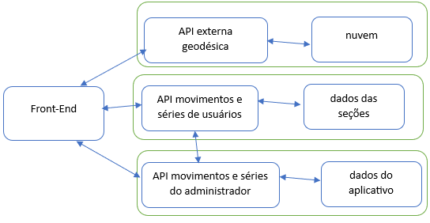

# Seqmovs

Este aplicativo visa oferecer uma ajuda para as pessoas que praticam exercícios físicos para se manter em forma.

A ideia é disponibilizar pequenos vídeos mostranto cada movimento junto com algumas características tais como: o tipo de trabalho muscular, a parte do corpo que é trabalhada, assim como um texto explicativo.

Este apliacativo utiliza uma APIRest e uma API externa para obter as coordenadas geodésicas do usuário, se ele permitir.
Essas coordenadas servirão para o administrador ter uma noção espacial da utilização do aplicativo.
Esta API externa é publicada por meio do objeto navigator.geolocation.
https://www.w3schools.com/jsref/api_geolocation.asp

Um usuário não precisa se identificar para usar o aplicativo, a menos que seja o administrador do aplicativo.
Todo o usuário recebe uma identificação interna que vale apenas para a sua seção de interação com o aplicativo.

Foi prevista a inclusão de mais uma API destinada a gerenciar os resutados das interações dos usuários nas escolhas dos movimentos e seu sequenciamento, formando séries de exercícios.

Foi prevista a utilização de conteiners por meio do Docker para permitir sua execução do aplicativo em ambientes diferentes do de desenvolvimento.

Trata-se da segunda versão de um MVP cujo objetivo é mostrar o resultado do aprendizado da Disciplina:
 **Desenvolvimento Back-end Avançado** 

---
## Como executar

Este Front-End necessita que Seqmovs API esteja em execução.
Então basta fazer o download do projeto e abrir o arquivo index.html no seu browser.

